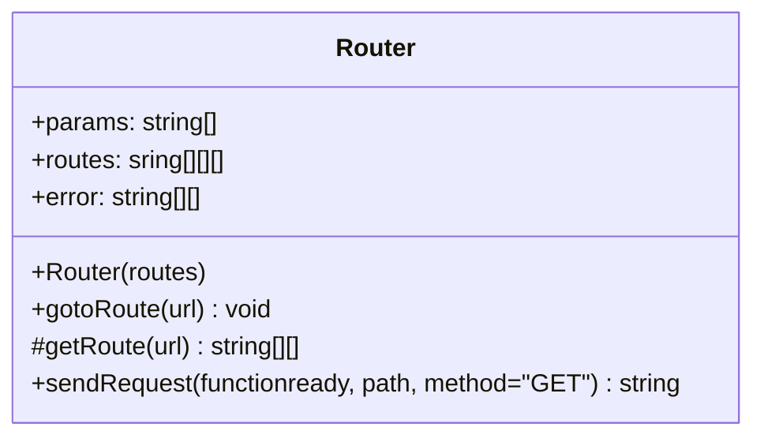

```mermaid
classDiagram
    class Router {
        +params: string[]
        +routes: sring[][][]
        +error: string[][]
        +Router(routes)
        +gotoRoute(url) void
        #getRoute(url) string[][]
        +sendRequest(functionready, path, method="GET") string
    }
```
